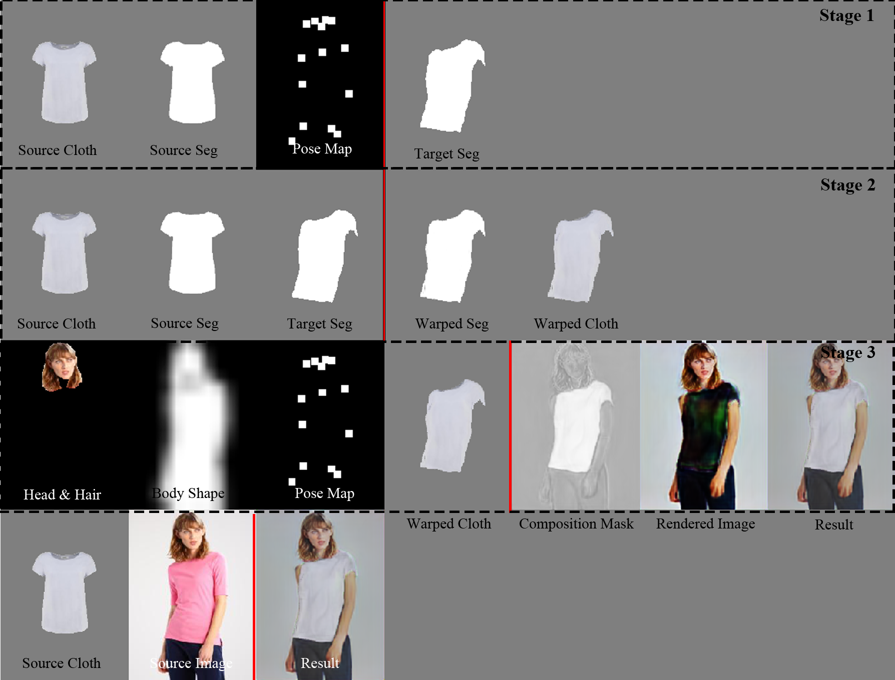
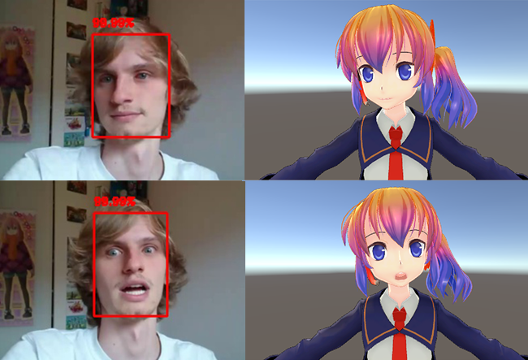

Title:   Shangzhe Di | Beihang University
Author:  Shangzhe Di
Date:    Jan. 16 2020
Description: Senior student at College of Software, Beihang University
Language: en
CSS: css/tufte.min.css
xhtml header: 

Shangzhe Di
===========

Senior student at [College of Software, Beihang University][TRI].\
Research intern at [Kwai Technology][KWAI].\
\
Research interests: *human-centered computer vision, 3D vision.*

![email] <shangzhe.di@gmail.com>\
![github] [`github.com/Becomebright`](https://github.com/Becomebright)\
![cv] [`cv.pdf`](./cv.pdf)\
![location] `Beijing, China`

[TRI]: https://ev.buaa.edu.cn/
[KWAI]: https://www.kwai.com/
[email]: ./img/email.svg "email" width=25px height=25px style="vertical-align: middle;"
[github]: ./img/github.svg "github" width=25px height=25px style="vertical-align: middle;"
[cv]: ./img/cv.svg "cv" width=25px height=25px style="vertical-align: middle;"
[location]: ./img/location.svg "location" width=25px height=25px style="vertical-align: middle;"

Projects
----------
* **Flow-based Virtual Try-On System**

* **Landmark-Free Facial Motion Transfer to VTubers**: <a href="pubs/vtuber_summary.pdf" target="blank"> Report</a>

---

<blockquote>

"I CAN DO ALL THINGS."

<footer>Stephen Curry, <cite>six-time NBA All-Star, three-time NBA Championship.</cite></footer>
</blockquote>

